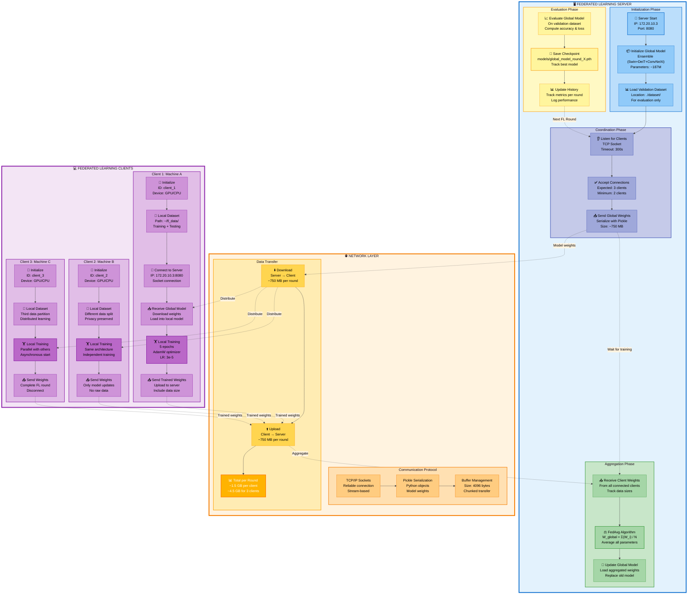
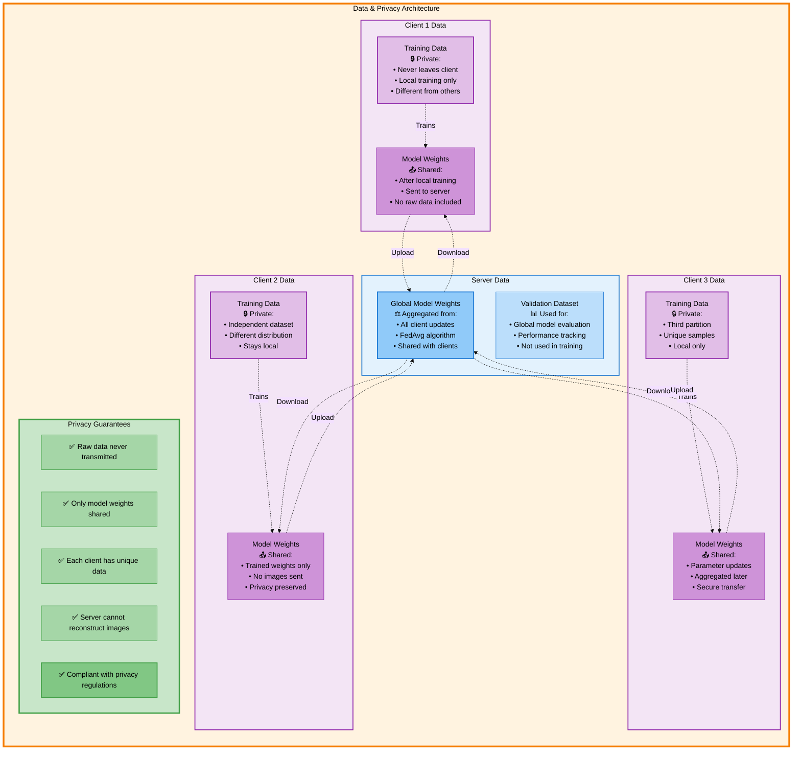
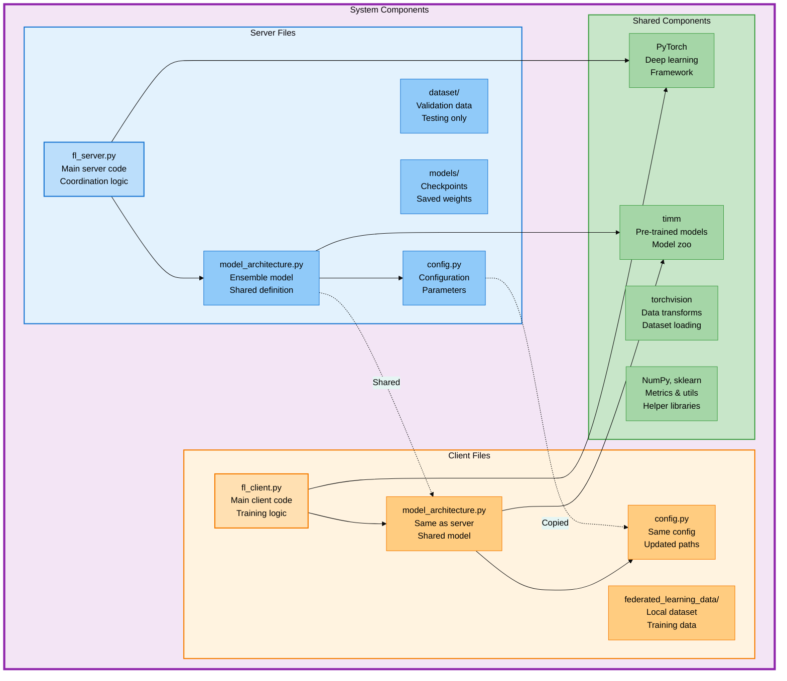
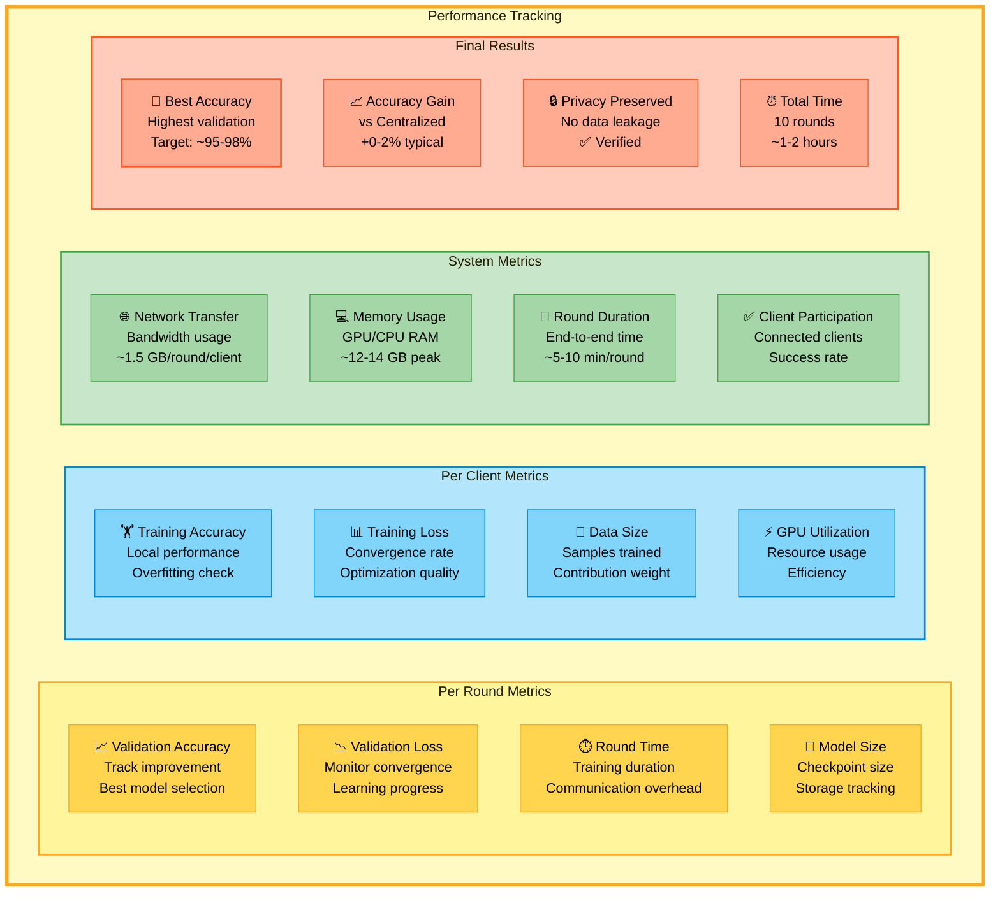
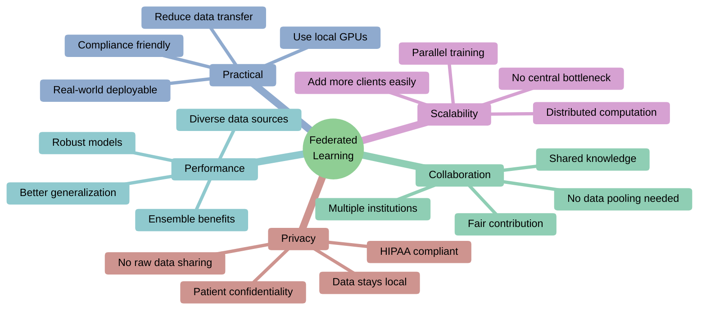

# 🌐 Federated Learning System Architecture - Detailed Block Diagram

This file contains comprehensive block diagrams of the complete Federated Learning system for distributed brain tumor classification.

---

## 🏛️ Complete Federated Learning System Architecture

---

## 🔄 Federated Learning Round - Detailed Sequence

```mermaid
%%{init: {'theme':'base', 'themeVariables': { 'primaryColor':'#e8f5e9','primaryTextColor':'#000','primaryBorderColor':'#43a047'}}}%%

sequenceDiagram
    autonumber
    
    participant Server as 🖥️ FL Server<br/>(172.20.10.3:8080)
    participant Network as 🌐 Network Layer<br/>(TCP/IP)
    participant Client1 as 💻 Client 1<br/>(Machine A)
    participant Client2 as 💻 Client 2<br/>(Machine B)
    participant Client3 as 💻 Client 3<br/>(Machine C)
    
    rect rgb(227, 242, 253)
    Note over Server: 📋 FL Round N Begins
    Server->>Server: Initialize round N
    Server->>Server: Set round counter
    end
    
    rect rgb(200, 230, 201)
    Note over Server,Client3: 🔌 Connection Phase
    Server->>Network: Listen on port 8080
    Network->>Network: Create socket
    
    Client1->>Network: Connect request
    Network->>Server: Accept Client 1
    Server->>Network: Connection established
    
    Client2->>Network: Connect request
    Network->>Server: Accept Client 2
    Server->>Network: Connection established
    
    Client3->>Network: Connect request
    Network->>Server: Accept Client 3
    Server->>Network: Connection established
    
    Note over Server: ✅ All clients connected
    end
    
    rect rgb(255, 249, 196)
    Note over Server,Client3: 📤 Model Distribution Phase
    Server->>Server: Serialize global model
    Server->>Network: Send model size (8 bytes)
    Network->>Client1: Forward size
    Network->>Client2: Forward size
    Network->>Client3: Forward size
    
    Server->>Network: Send model weights (~750 MB)
    Network->>Client1: Stream weights (chunks)
    Network->>Client2: Stream weights (chunks)
    Network->>Client3: Stream weights (chunks)
    
    Client1->>Client1: Deserialize & load weights
    Client2->>Client2: Deserialize & load weights
    Client3->>Client3: Deserialize & load weights
    
    Note over Client1,Client3: ✓ Models loaded
    end
    
    rect rgb(225, 190, 231)
    Note over Client1,Client3: 🏋️ Local Training Phase
    
    par Parallel Training
        Client1->>Client1: Load local dataset
        Client1->>Client1: Create DataLoader
        loop 5 Epochs
            Client1->>Client1: Forward pass
            Client1->>Client1: Compute loss
            Client1->>Client1: Backward pass
            Client1->>Client1: Update weights
        end
        Client1->>Client1: Extract model weights
        
    and
        Client2->>Client2: Load local dataset
        Client2->>Client2: Create DataLoader
        loop 5 Epochs
            Client2->>Client2: Forward pass
            Client2->>Client2: Compute loss
            Client2->>Client2: Backward pass
            Client2->>Client2: Update weights
        end
        Client2->>Client2: Extract model weights
        
    and
        Client3->>Client3: Load local dataset
        Client3->>Client3: Create DataLoader
        loop 5 Epochs
            Client3->>Client3: Forward pass
            Client3->>Client3: Compute loss
            Client3->>Client3: Backward pass
            Client3->>Client3: Update weights
        end
        Client3->>Client3: Extract model weights
    end
    
    Note over Client1,Client3: ✓ Training complete
    end
    
    rect rgb(255, 235, 238)
    Note over Server,Client3: 📥 Weight Collection Phase
    
    Client1->>Client1: Serialize weights + metadata
    Client1->>Network: Send size (8 bytes)
    Client1->>Network: Send weights (~750 MB)
    Network->>Server: Receive from Client 1
    Server->>Server: Store weights_1, size_1
    
    Client2->>Client2: Serialize weights + metadata
    Client2->>Network: Send size (8 bytes)
    Client2->>Network: Send weights (~750 MB)
    Network->>Server: Receive from Client 2
    Server->>Server: Store weights_2, size_2
    
    Client3->>Client3: Serialize weights + metadata
    Client3->>Network: Send size (8 bytes)
    Client3->>Network: Send weights (~750 MB)
    Network->>Server: Receive from Client 3
    Server->>Server: Store weights_3, size_3
    
    Note over Server: ✓ All weights collected
    end
    
    rect rgb(255, 224, 130)
    Note over Server: ⚖️ Aggregation Phase (FedAvg)
    Server->>Server: Initialize averaged_weights
    loop For each parameter
        Server->>Server: Sum all client weights
        Server->>Server: Divide by num_clients
    end
    Server->>Server: Load averaged weights
    Server->>Server: Update global model
    Note over Server: ✓ Global model updated
    end
    
    rect rgb(179, 229, 252)
    Note over Server: 📊 Evaluation Phase
    Server->>Server: Set model to eval mode
    Server->>Server: Load validation dataset
    loop For each batch
        Server->>Server: Forward pass (no grad)
        Server->>Server: Compute predictions
        Server->>Server: Calculate metrics
    end
    Server->>Server: Aggregate metrics
    Server->>Server: Val Acc: X.XX%
    Server->>Server: Val Loss: X.XXX
    end
    
    rect rgb(200, 230, 201)
    Note over Server: 💾 Checkpoint Phase
    Server->>Server: Save model weights
    Server->>Server: Save to models/global_model_round_N.pth
    Server->>Server: Update training history
    Server->>Server: Log metrics
    Note over Server: ✓ Checkpoint saved
    end
    
    rect rgb(255, 205, 210)
    Note over Server,Client3: 🔌 Disconnect Phase
    Server->>Client1: Close connection
    Server->>Client2: Close connection
    Server->>Client3: Close connection
    
    Client1->>Client1: Disconnect & cleanup
    Client2->>Client2: Disconnect & cleanup
    Client3->>Client3: Disconnect & cleanup
    end
    
    rect rgb(232, 234, 246)
    Note over Server: 🔄 Round Complete
    Server->>Server: Round N finished
    Server->>Server: Increment round counter
    alt More rounds remaining
        Server->>Server: Start Round N+1
    else All rounds complete
        Server->>Server: Save final model
        Server->>Server: Print summary
        Note over Server: ✅ Training Complete
    end
    end
```

---

## 🗂️ Data Flow Architecture

---

## 📈 Training Progress Timeline

```mermaid
%%{init: {'theme':'base', 'themeVariables': { 'primaryColor':'#e8eaf6','primaryTextColor':'#000','primaryBorderColor':'#3f51b5'}}}%%

gantt
    title Federated Learning Training Timeline (10 Rounds)
    dateFormat  X
    axisFormat %s
    
    section Server Init
    Initialize Model           :done, init, 0, 30
    Load Validation Data       :done, val, 30, 50
    Start Socket Server        :done, socket, 50, 60
    
    section Round 1
    Wait for Clients          :active, r1_wait, 60, 90
    Send Model (750MB)        :active, r1_send, 90, 150
    Client Training           :crit, r1_train, 150, 450
    Receive Weights           :active, r1_recv, 450, 510
    FedAvg Aggregation        :r1_agg, 510, 540
    Evaluation                :r1_eval, 540, 570
    Save Checkpoint           :r1_save, 570, 580
    
    section Round 2
    Send Model                :r2_send, 580, 640
    Client Training           :crit, r2_train, 640, 940
    Receive & Aggregate       :r2_agg, 940, 1000
    Evaluate & Save           :r2_save, 1000, 1030
    
    section Round 3
    Send Model                :r3_send, 1030, 1090
    Client Training           :crit, r3_train, 1090, 1390
    Receive & Aggregate       :r3_agg, 1390, 1450
    Evaluate & Save           :r3_save, 1450, 1480
    
    section Round 4-10
    Repeat Rounds 4-10        :r4_10, 1480, 3500
    
    section Finalization
    Save Final Model          :done, final, 3500, 3530
    Print Summary             :done, summary, 3530, 3550
    Training Complete         :milestone, complete, 3550, 3550
```

---

## 🔐 Security & Privacy Architecture

```mermaid
%%{init: {'theme':'base', 'themeVariables': { 'primaryColor':'#e8f5e9','primaryTextColor':'#000','primaryBorderColor':'#43a047'}}}%%

flowchart TB
    subgraph SECURITY ["Security & Privacy Layers"]
        style SECURITY fill:#e8f5e9,stroke:#43a047,stroke-width:4px
        
        subgraph LAYER1 ["Layer 1: Data Privacy"]
            style LAYER1 fill:#c8e6c9,stroke:#43a047,stroke-width:2px
            L1_1["🔒 Data Isolation<br/>Each client owns data<br/>No data sharing"]
            L1_2["📊 Decentralized Storage<br/>Distributed across clients<br/>No central repository"]
            L1_3["🚫 No Raw Data Transfer<br/>Only model parameters<br/>Images stay local"]
            
            style L1_1 fill:#a5d6a7,stroke:#43a047
            style L1_2 fill:#a5d6a7,stroke:#43a047
            style L1_3 fill:#a5d6a7,stroke:#43a047
        end
        
        subgraph LAYER2 ["Layer 2: Communication Security"]
            style LAYER2 fill:#b3e5fc,stroke:#0288d1,stroke-width:2px
            L2_1["🔐 TCP/IP Encryption<br/>Secure sockets<br/>Optional TLS/SSL"]
            L2_2["✅ Authentication<br/>Client ID verification<br/>IP whitelisting"]
            L2_3["📦 Integrity Checks<br/>Checksum validation<br/>Corruption detection"]
            
            style L2_1 fill:#81d4fa,stroke:#0288d1
            style L2_2 fill:#81d4fa,stroke:#0288d1
            style L2_3 fill:#81d4fa,stroke:#0288d1
        end
        
        subgraph LAYER3 ["Layer 3: Model Privacy"]
            style LAYER3 fill:#fff9c4,stroke:#f9a825,stroke-width:2px
            L3_1["⚖️ Federated Averaging<br/>Aggregate weights<br/>No individual tracking"]
            L3_2["🎭 Model Anonymity<br/>Cannot reverse weights<br/>to original data"]
            L3_3["📉 Differential Privacy<br/>(Optional) Add noise<br/>to weight updates"]
            
            style L3_1 fill:#fff59d,stroke:#f9a825
            style L3_2 fill:#fff59d,stroke:#f9a825
            style L3_3 fill:#fff59d,stroke:#f9a825
        end
        
        subgraph LAYER4 ["Layer 4: System Security"]
            style LAYER4 fill:#ffccbc,stroke:#ff5722,stroke-width:2px
            L4_1["🔥 Firewall Protection<br/>Port filtering<br/>Access control"]
            L4_2["⏱️ Timeout Management<br/>Prevent hanging<br/>Connection limits"]
            L4_3["📝 Audit Logging<br/>Track all operations<br/>Detect anomalies"]
            
            style L4_1 fill:#ffab91,stroke:#ff5722
            style L4_2 fill:#ffab91,stroke:#ff5722
            style L4_3 fill:#ffab91,stroke:#ff5722
        end
        
        LAYER1 --> LAYER2
        LAYER2 --> LAYER3
        LAYER3 --> LAYER4
        
        subgraph THREATS ["🛡️ Protection Against"]
            style THREATS fill:#ffebee,stroke:#d32f2f,stroke-width:2px
            T1["❌ Data Breach<br/>Protected by: No raw data transfer"]
            T2["❌ Model Inversion<br/>Protected by: Aggregation + Noise"]
            T3["❌ Membership Inference<br/>Protected by: DP + Ensemble"]
            T4["❌ Poisoning Attacks<br/>Protected by: Validation checks"]
            
            style T1 fill:#ffcdd2,stroke:#d32f2f
            style T2 fill:#ffcdd2,stroke:#d32f2f
            style T3 fill:#ffcdd2,stroke:#d32f2f
            style T4 fill:#ffcdd2,stroke:#d32f2f
        end
    end
```

---

## 💾 System Components & Files

---

## 📊 Performance Metrics Dashboard

---

## 🎯 System Advantages

### **Why Federated Learning?**

---

**📄 Document Created:** Federated Learning System Architecture Diagrams  
**🎨 Format:** Mermaid Diagrams with Detailed Color Coding  
**📊 Detail Level:** Comprehensive - End-to-End System  
**🔍 Includes:** Sequence diagrams, Flow charts, Gantt charts, Security layers, Data flow
