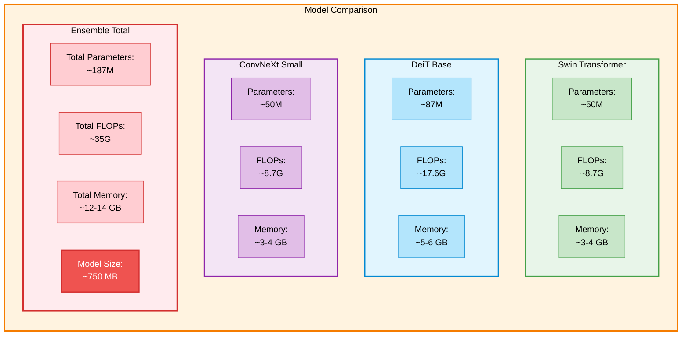
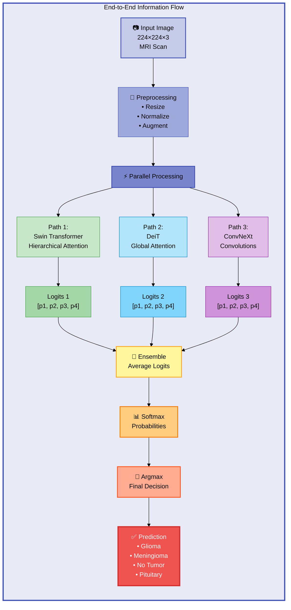

# 🏗️ Ensemble Model Architecture - Detailed Block Diagram

This file contains detailed block diagrams of the Ensemble Model architecture used for brain tumor classification.

---

## 📊 Complete Ensemble Model Architecture

```mermaid
%%{init: {'theme':'base', 'themeVariables': { 'primaryColor':'#e3f2fd','primaryTextColor':'#000','primaryBorderColor':'#1976d2','lineColor':'#424242','secondaryColor':'#fff3e0','tertiaryColor':'#f3e5f5'}}}%%

flowchart TB
    subgraph Input ["🖼️ Input Layer"]
        style Input fill:#e3f2fd,stroke:#1976d2,stroke-width:3px
        IMG["Brain MRI Image<br/>Shape: (Batch, 3, 224, 224)<br/>Normalized RGB"]
        style IMG fill:#bbdefb,stroke:#1976d2,stroke-width:2px
    end

    subgraph Ensemble ["🎯 Ensemble Model"]
        style Ensemble fill:#fff3e0,stroke:#f57c00,stroke-width:3px
        
        subgraph Model1 ["🌟 Swin Transformer Small"]
            style Model1 fill:#e8f5e9,stroke:#43a047,stroke-width:2px
            SWIN_PATCH["Patch Partition<br/>4×4 patches<br/>↓<br/>Patch Embedding<br/>Dim: 96"]
            SWIN_STAGE1["Stage 1<br/>Swin Blocks (Local)<br/>Window Size: 7×7<br/>Heads: 3"]
            SWIN_STAGE2["Stage 2<br/>Swin Blocks (Global)<br/>Shifted Windows<br/>Heads: 6"]
            SWIN_STAGE3["Stage 3<br/>Swin Blocks<br/>Hierarchical<br/>Heads: 12"]
            SWIN_STAGE4["Stage 4<br/>Swin Blocks<br/>Deep Features<br/>Heads: 24"]
            SWIN_HEAD["Classification Head<br/>Global Avg Pool<br/>↓<br/>FC Layer<br/>Output: 4 classes"]
            
            SWIN_PATCH --> SWIN_STAGE1
            SWIN_STAGE1 --> SWIN_STAGE2
            SWIN_STAGE2 --> SWIN_STAGE3
            SWIN_STAGE3 --> SWIN_STAGE4
            SWIN_STAGE4 --> SWIN_HEAD
            
            style SWIN_PATCH fill:#c8e6c9,stroke:#43a047
            style SWIN_STAGE1 fill:#c8e6c9,stroke:#43a047
            style SWIN_STAGE2 fill:#c8e6c9,stroke:#43a047
            style SWIN_STAGE3 fill:#c8e6c9,stroke:#43a047
            style SWIN_STAGE4 fill:#c8e6c9,stroke:#43a047
            style SWIN_HEAD fill:#a5d6a7,stroke:#43a047,stroke-width:2px
        end
        
        subgraph Model2 ["⚡ DeiT Base Distilled"]
            style Model2 fill:#e1f5fe,stroke:#0288d1,stroke-width:2px
            DEIT_PATCH["Patch Embedding<br/>16×16 patches<br/>↓<br/>Linear Projection<br/>Dim: 768"]
            DEIT_POS["Positional Encoding<br/>+ CLS Token<br/>+ Distillation Token"]
            DEIT_ENC1["Transformer Encoder<br/>Layer 1-4<br/>Multi-Head Attention<br/>Heads: 12"]
            DEIT_ENC2["Transformer Encoder<br/>Layer 5-8<br/>Feed Forward Network<br/>MLP Ratio: 4"]
            DEIT_ENC3["Transformer Encoder<br/>Layer 9-12<br/>Layer Normalization<br/>Dropout: 0.1"]
            DEIT_HEAD["Classification Head<br/>CLS Token Output<br/>↓<br/>FC Layer<br/>Output: 4 classes"]
            
            DEIT_PATCH --> DEIT_POS
            DEIT_POS --> DEIT_ENC1
            DEIT_ENC1 --> DEIT_ENC2
            DEIT_ENC2 --> DEIT_ENC3
            DEIT_ENC3 --> DEIT_HEAD
            
            style DEIT_PATCH fill:#b3e5fc,stroke:#0288d1
            style DEIT_POS fill:#b3e5fc,stroke:#0288d1
            style DEIT_ENC1 fill:#b3e5fc,stroke:#0288d1
            style DEIT_ENC2 fill:#b3e5fc,stroke:#0288d1
            style DEIT_ENC3 fill:#b3e5fc,stroke:#0288d1
            style DEIT_HEAD fill:#81d4fa,stroke:#0288d1,stroke-width:2px
        end
        
        subgraph Model3 ["🔷 ConvNeXt Small"]
            style Model3 fill:#f3e5f5,stroke:#8e24aa,stroke-width:2px
            CONV_STEM["Stem Layer<br/>4×4 Conv<br/>Stride: 4<br/>Channels: 96"]
            CONV_STAGE1["Stage 1<br/>ConvNeXt Blocks×3<br/>Depthwise Conv 7×7<br/>Channels: 96"]
            CONV_STAGE2["Stage 2<br/>ConvNeXt Blocks×3<br/>Downsampling<br/>Channels: 192"]
            CONV_STAGE3["Stage 3<br/>ConvNeXt Blocks×27<br/>Deep Convolutions<br/>Channels: 384"]
            CONV_STAGE4["Stage 4<br/>ConvNeXt Blocks×3<br/>High-level Features<br/>Channels: 768"]
            CONV_HEAD["Classification Head<br/>Global Avg Pool<br/>↓<br/>Layer Norm + FC<br/>Output: 4 classes"]
            
            CONV_STEM --> CONV_STAGE1
            CONV_STAGE1 --> CONV_STAGE2
            CONV_STAGE2 --> CONV_STAGE3
            CONV_STAGE3 --> CONV_STAGE4
            CONV_STAGE4 --> CONV_HEAD
            
            style CONV_STEM fill:#e1bee7,stroke:#8e24aa
            style CONV_STAGE1 fill:#e1bee7,stroke:#8e24aa
            style CONV_STAGE2 fill:#e1bee7,stroke:#8e24aa
            style CONV_STAGE3 fill:#e1bee7,stroke:#8e24aa
            style CONV_STAGE4 fill:#e1bee7,stroke:#8e24aa
            style CONV_HEAD fill:#ce93d8,stroke:#8e24aa,stroke-width:2px
        end
    end

    subgraph Aggregation ["🔄 Aggregation Layer"]
        style Aggregation fill:#fff9c4,stroke:#f9a825,stroke-width:3px
        LOGITS1["Logits from Swin<br/>Shape: (Batch, 4)<br/>Confidence Scores"]
        LOGITS2["Logits from DeiT<br/>Shape: (Batch, 4)<br/>Confidence Scores"]
        LOGITS3["Logits from ConvNeXt<br/>Shape: (Batch, 4)<br/>Confidence Scores"]
        STACK["Stack Logits<br/>Shape: (3, Batch, 4)<br/>Combine Predictions"]
        AVERAGE["Average Pooling<br/>Mean across models<br/>Shape: (Batch, 4)"]
        
        LOGITS1 --> STACK
        LOGITS2 --> STACK
        LOGITS3 --> STACK
        STACK --> AVERAGE
        
        style LOGITS1 fill:#fff59d,stroke:#f9a825
        style LOGITS2 fill:#fff59d,stroke:#f9a825
        style LOGITS3 fill:#fff59d,stroke:#f9a825
        style STACK fill:#ffee58,stroke:#f9a825,stroke-width:2px
        style AVERAGE fill:#fdd835,stroke:#f9a825,stroke-width:2px
    end

    subgraph Output ["🎯 Output Layer"]
        style Output fill:#ffebee,stroke:#d32f2f,stroke-width:3px
        SOFTMAX["Softmax Activation<br/>Convert to Probabilities<br/>Sum = 1.0"]
        PRED["Final Prediction<br/>ArgMax<br/>↓<br/>Class Label"]
        CLASSES["4 Classes:<br/>• Glioma Tumor<br/>• Meningioma Tumor<br/>• No Tumor<br/>• Pituitary Tumor"]
        
        SOFTMAX --> PRED
        PRED --> CLASSES
        
        style SOFTMAX fill:#ffcdd2,stroke:#d32f2f
        style PRED fill:#ef9a9a,stroke:#d32f2f,stroke-width:2px
        style CLASSES fill:#e57373,stroke:#d32f2f,stroke-width:3px,color:#fff
    end

    %% Connections
    IMG --> Model1
    IMG --> Model2
    IMG --> Model3
    
    SWIN_HEAD --> LOGITS1
    DEIT_HEAD --> LOGITS2
    CONV_HEAD --> LOGITS3
    
    AVERAGE --> SOFTMAX

    %% Labels
    classDef inputClass fill:#e3f2fd,stroke:#1976d2,stroke-width:2px
    classDef processClass fill:#fff3e0,stroke:#f57c00,stroke-width:2px
    classDef outputClass fill:#ffebee,stroke:#d32f2f,stroke-width:2px
```

---

## 🔍 Individual Model Details

### 1️⃣ Swin Transformer Architecture

```mermaid
%%{init: {'theme':'base', 'themeVariables': { 'primaryColor':'#e8f5e9','primaryTextColor':'#000','primaryBorderColor':'#43a047','lineColor':'#424242'}}}%%

flowchart TB
    subgraph SWIN ["Swin Transformer Small - Detailed Architecture"]
        style SWIN fill:#e8f5e9,stroke:#43a047,stroke-width:3px
        
        INPUT_S["Input: 224×224×3"]
        
        subgraph PATCH ["Patch Partition & Embedding"]
            style PATCH fill:#c8e6c9,stroke:#43a047,stroke-width:2px
            PP["Partition into 4×4 patches<br/>56×56 patches total"]
            PE["Linear Embedding<br/>Dim: 96"]
            PP --> PE
        end
        
        subgraph S1 ["Stage 1: H/4 × W/4"]
            style S1 fill:#a5d6a7,stroke:#43a047,stroke-width:2px
            SB1["Swin Block ×2<br/>Window Attention (7×7)<br/>Shifted Window Attention<br/>MLP (×4 expansion)"]
        end
        
        PM1["Patch Merging<br/>Downsample ×2<br/>Dim: 192"]
        
        subgraph S2 ["Stage 2: H/8 × W/8"]
            style S2 fill:#a5d6a7,stroke:#43a047,stroke-width:2px
            SB2["Swin Block ×2<br/>Window Attention<br/>Shifted Windows<br/>Heads: 6"]
        end
        
        PM2["Patch Merging<br/>Downsample ×2<br/>Dim: 384"]
        
        subgraph S3 ["Stage 3: H/16 × W/16"]
            style S3 fill:#a5d6a7,stroke:#43a047,stroke-width:2px
            SB3["Swin Block ×18<br/>Deep Processing<br/>Heads: 12"]
        end
        
        PM3["Patch Merging<br/>Downsample ×2<br/>Dim: 768"]
        
        subgraph S4 ["Stage 4: H/32 × W/32"]
            style S4 fill:#a5d6a7,stroke:#43a047,stroke-width:2px
            SB4["Swin Block ×2<br/>Heads: 24<br/>Final Features"]
        end
        
        subgraph HEAD_S ["Classification Head"]
            style HEAD_S fill:#81c784,stroke:#43a047,stroke-width:2px
            GAP_S["Global Average Pool"]
            NORM_S["Layer Normalization"]
            FC_S["Fully Connected<br/>768 → 4"]
        end
        
        OUTPUT_S["Output Logits<br/>Shape: (Batch, 4)"]
        
        INPUT_S --> PATCH
        PATCH --> S1
        S1 --> PM1
        PM1 --> S2
        S2 --> PM2
        PM2 --> S3
        S3 --> PM3
        PM3 --> S4
        S4 --> HEAD_S
        GAP_S --> NORM_S
        NORM_S --> FC_S
        FC_S --> OUTPUT_S
        
        style INPUT_S fill:#c8e6c9,stroke:#43a047,stroke-width:2px
        style OUTPUT_S fill:#66bb6a,stroke:#43a047,stroke-width:3px,color:#fff
    end
```

### 2️⃣ DeiT Architecture

```mermaid
%%{init: {'theme':'base', 'themeVariables': { 'primaryColor':'#e1f5fe','primaryTextColor':'#000','primaryBorderColor':'#0288d1','lineColor':'#424242'}}}%%

flowchart TB
    subgraph DEIT ["DeiT Base Distilled - Detailed Architecture"]
        style DEIT fill:#e1f5fe,stroke:#0288d1,stroke-width:3px
        
        INPUT_D["Input: 224×224×3"]
        
        subgraph PATCHIFY ["Patch Embedding"]
            style PATCHIFY fill:#b3e5fc,stroke:#0288d1,stroke-width:2px
            PP_D["Split into 16×16 patches<br/>14×14 = 196 patches"]
            PROJ_D["Linear Projection<br/>Dim: 768"]
            PP_D --> PROJ_D
        end
        
        subgraph TOKENS ["Special Tokens"]
            style TOKENS fill:#81d4fa,stroke:#0288d1,stroke-width:2px
            CLS["[CLS] Token<br/>Classification"]
            DIST["[DIST] Token<br/>Distillation"]
            POS["Positional Embeddings<br/>Learned (196+2)"]
        end
        
        CONCAT["Concatenate<br/>[CLS] + [DIST] + Patches<br/>Total: 198 tokens"]
        
        subgraph TRANSFORMER ["Transformer Encoder (12 Layers)"]
            style TRANSFORMER fill:#4fc3f7,stroke:#0288d1,stroke-width:2px
            
            subgraph LAYER ["Transformer Layer (×12)"]
                style LAYER fill:#29b6f6,stroke:#0288d1,stroke-width:2px
                LN1["Layer Norm"]
                MSA["Multi-Head Self-Attention<br/>Heads: 12<br/>QKV Projection"]
                RES1["Residual Connection"]
                LN2["Layer Norm"]
                MLP["MLP Block<br/>768 → 3072 → 768<br/>GELU Activation"]
                RES2["Residual Connection"]
                
                LN1 --> MSA
                MSA --> RES1
                RES1 --> LN2
                LN2 --> MLP
                MLP --> RES2
            end
        end
        
        subgraph HEAD_D ["Dual Classification Heads"]
            style HEAD_D fill:#0288d1,stroke:#01579b,stroke-width:2px,color:#fff
            CLS_HEAD["CLS Token Output<br/>Layer Norm<br/>↓<br/>FC: 768 → 4"]
            DIST_HEAD["DIST Token Output<br/>Layer Norm<br/>↓<br/>FC: 768 → 4"]
            AVG_HEAD["Average Both<br/>Final Logits"]
            
            CLS_HEAD --> AVG_HEAD
            DIST_HEAD --> AVG_HEAD
        end
        
        OUTPUT_D["Output Logits<br/>Shape: (Batch, 4)"]
        
        INPUT_D --> PATCHIFY
        PATCHIFY --> TOKENS
        TOKENS --> CONCAT
        CONCAT --> TRANSFORMER
        TRANSFORMER --> HEAD_D
        AVG_HEAD --> OUTPUT_D
        
        style INPUT_D fill:#b3e5fc,stroke:#0288d1,stroke-width:2px
        style OUTPUT_D fill:#0277bd,stroke:#01579b,stroke-width:3px,color:#fff
    end
```

### 3️⃣ ConvNeXt Architecture

```mermaid
%%{init: {'theme':'base', 'themeVariables': { 'primaryColor':'#f3e5f5','primaryTextColor':'#000','primaryBorderColor':'#8e24aa','lineColor':'#424242'}}}%%

flowchart TB
    subgraph CONVNEXT ["ConvNeXt Small - Detailed Architecture"]
        style CONVNEXT fill:#f3e5f5,stroke:#8e24aa,stroke-width:3px
        
        INPUT_C["Input: 224×224×3"]
        
        subgraph STEM_C ["Stem Layer"]
            style STEM_C fill:#e1bee7,stroke:#8e24aa,stroke-width:2px
            CONV_STEM_C["4×4 Convolution<br/>Stride: 4<br/>Channels: 96<br/>Aggressive Downsampling"]
            NORM_STEM["Layer Norm"]
            CONV_STEM_C --> NORM_STEM
        end
        
        subgraph STAGE1_C ["Stage 1: 56×56"]
            style STAGE1_C fill:#ce93d8,stroke:#8e24aa,stroke-width:2px
            direction TB
            CB1["ConvNeXt Block ×3"]
            subgraph CB1_DETAIL ["Block Details"]
                DW1["Depthwise Conv 7×7<br/>Groups = Channels"]
                LN1_C["Layer Norm"]
                PW1["Pointwise Conv 1×1<br/>Expansion ×4"]
                GELU1["GELU Activation"]
                PW2["Pointwise Conv 1×1<br/>Projection back"]
                DROP1["Drop Path"]
                RES1_C["Residual Add"]
                
                DW1 --> LN1_C
                LN1_C --> PW1
                PW1 --> GELU1
                GELU1 --> PW2
                PW2 --> DROP1
                DROP1 --> RES1_C
            end
        end
        
        DS1["Downsampling<br/>Layer Norm + 2×2 Conv<br/>Channels: 192"]
        
        subgraph STAGE2_C ["Stage 2: 28×28"]
            style STAGE2_C fill:#ce93d8,stroke:#8e24aa,stroke-width:2px
            CB2["ConvNeXt Block ×3<br/>Channels: 192"]
        end
        
        DS2["Downsampling<br/>Channels: 384"]
        
        subgraph STAGE3_C ["Stage 3: 14×14"]
            style STAGE3_C fill:#ce93d8,stroke:#8e24aa,stroke-width:2px
            CB3["ConvNeXt Block ×27<br/>Deep Processing<br/>Channels: 384"]
        end
        
        DS3["Downsampling<br/>Channels: 768"]
        
        subgraph STAGE4_C ["Stage 4: 7×7"]
            style STAGE4_C fill:#ce93d8,stroke:#8e24aa,stroke-width:2px
            CB4["ConvNeXt Block ×3<br/>Channels: 768"]
        end
        
        subgraph HEAD_C ["Classification Head"]
            style HEAD_C fill:#ab47bc,stroke:#8e24aa,stroke-width:2px,color:#fff
            GAP_C["Global Average Pool<br/>7×7 → 1×1"]
            LN_C["Layer Norm"]
            FC_C["Fully Connected<br/>768 → 4"]
        end
        
        OUTPUT_C["Output Logits<br/>Shape: (Batch, 4)"]
        
        INPUT_C --> STEM_C
        STEM_C --> STAGE1_C
        STAGE1_C --> DS1
        DS1 --> STAGE2_C
        STAGE2_C --> DS2
        DS2 --> STAGE3_C
        STAGE3_C --> DS3
        DS3 --> STAGE4_C
        STAGE4_C --> HEAD_C
        GAP_C --> LN_C
        LN_C --> FC_C
        FC_C --> OUTPUT_C
        
        style INPUT_C fill:#e1bee7,stroke:#8e24aa,stroke-width:2px
        style OUTPUT_C fill:#9c27b0,stroke:#7b1fa2,stroke-width:3px,color:#fff
    end
```

---

## 📊 Model Statistics

---

## 🎯 Information Flow Diagram

---

## 💡 Key Features

### **Why This Ensemble Works:**

1. **Complementary Strengths:**
   - 🌟 Swin: Local + Global patterns through hierarchical windows
   - ⚡ DeiT: Pure attention-based global reasoning
   - 🔷 ConvNeXt: Inductive biases from convolutions

2. **Diversity Benefits:**
   - Different architectural paradigms
   - Different receptive field strategies
   - Different feature extraction methods

3. **Robustness:**
   - Reduces individual model errors
   - More stable predictions
   - Better generalization

### **Training Strategy:**
- All models use **ImageNet pre-trained weights**
- Fine-tuned together as ensemble
- AdamW optimizer with low learning rate (3e-5)
- Label smoothing (0.05) for better generalization

---

**📄 Document Created:** Ensemble Model Architecture Diagrams
**🎨 Format:** Mermaid Flowcharts with Color Coding
**📊 Detail Level:** Comprehensive - Layer by Layer
